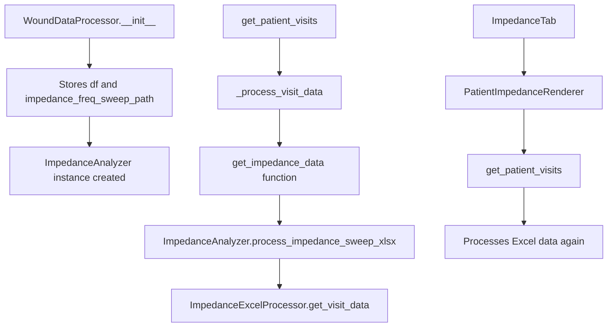

# Process

```mermaid

graph TD
    A[WoundDataProcessor.__init__] --> B[Stores df and impedance_freq_sweep_path]
    B --> C[ImpedanceAnalyzer instance created]

    D[get_patient_visits] --> E[_process_visit_data]
    E --> F[get_impedance_data function]
    F --> G[ImpedanceAnalyzer.process_impedance_sweep_xlsx]
    G --> H[ImpedanceExcelProcessor.get_visit_data]

    I[ImpedanceTab] --> J[PatientImpedanceRenderer]
    J --> K[get_patient_visits]
    K --> L[Processes Excel data again]

```
